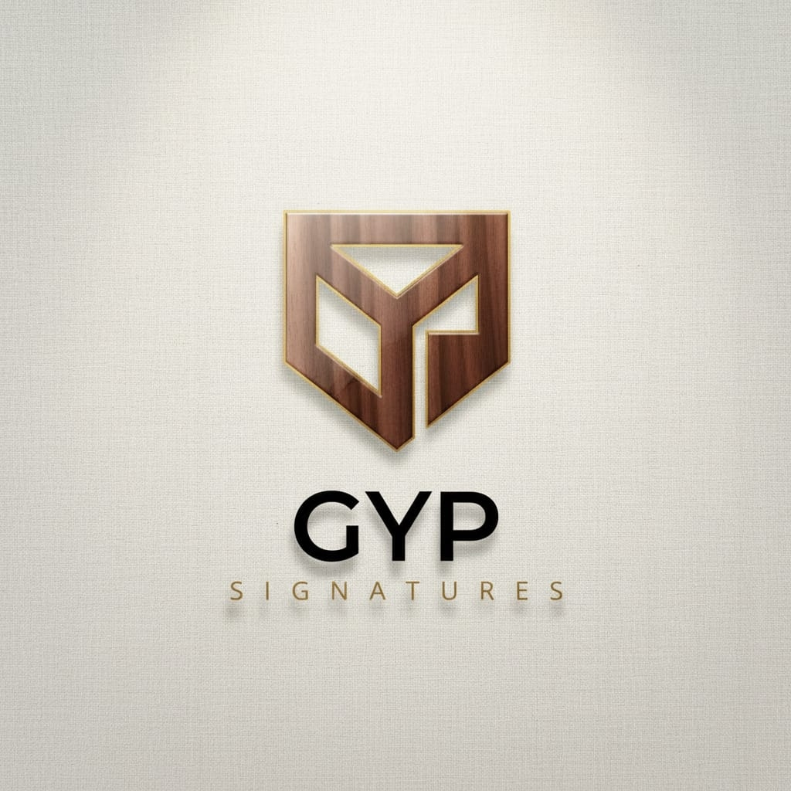

# 🏠 GYP SIGNATURES — Architectural Furniture & Turnkey Interior Design

> **Awwwards-Level Digital Experience** crafted for modern homeowners, apartments, and studios across Andhra Pradesh & Tirupati District.



---

## 🌟 Brand & Atelier Identity

- **Brand Name**: **GYP SIGNATURES**
- **Tagline**: *"Furniture that feels like home"*
- **Location**: Srikalahasthi, Tirupati District, Andhra Pradesh, INDIA — 517644
- **Google Maps**: [Experience Center & Workshop](https://share.google/SDO6mLLMBKUosE16b)
- **Direct Hotline**: `+91 9393972660`
- **Email**: `gypsignatures@gmail.com`
- **Core Offerings**: Sofas, Beds, Dining, Chairs, Storage, Lighting, Custom/Modular Furniture, Full Interior Design Services, Interior Wood Works.

---

## ⚡ Tech Stack & Architecture

- **Framework**: **Next.js 16+ (App Router)** + React 19 + TypeScript
- **Styling**: **Tailwind CSS v4** with CSS variable design tokens and glassmorphism
- **Animations**:
  - **GSAP & ScrollTrigger** for scroll tracking and fluid reveals
  - **Lenis** smooth scrolling synchronized with the GSAP ticker
  - **Framer Motion** for spring animations, curtain wipes, mobile drawers, and micro-interactions
- **3D Interactive Scene**: **Three.js** + **React Three Fiber (@react-three/fiber)** + **@react-three/drei**
- **State Management**: **Zustand** with `localStorage` persistence for the Sanctuary Cart & Wishlist
- **Typography**: Google Fonts **Fraunces** (optical display serif with italic swashes) & **Inter** (clean modern UI sans)
- **Icons**: Lucide React + custom geometric brand SVGs
- **Celebration**: Canvas Confetti for form submissions

---

## 🏛️ Built Pages & Sections

### 1. Master Homepage (`app/page.tsx`)
1. **Introductory Loader (`components/sections/Loader.tsx`)**:
   - Brand emblem presentation with numeric progress counter `00` → `100%`
   - Smooth curtain reveal easing into the hero
   - Session storage flag so returning users aren't delayed
2. **Floating Glass Pill Header (`components/sections/Header.tsx`)**:
   - Hides on scroll-down, reveals on scroll-up
   - Brand logo badge + navigation links
   - Real-time Wishlist count & Cart count badges
   - Sun/Moon theme toggle (Dark / Light mode)
   - Fullscreen animated mobile menu with direct WhatsApp & phone actions
3. **Hero Section (`components/sections/Hero.tsx`)**:
   - Interactive 3D procedural sofa in React Three Fiber with studio lighting and soft shadows
   - Rotates dynamically with mouse movement
   - Live color customizer swatches (Terracotta, Olive Moss, Charcoal, Butter Cream)
   - Wireframe 3D toggle
   - Giant fluid typography with terracotta gradient emphasis
   - Magnetic buttons (`components/ui/MagneticButton.tsx`)
   - Quick guarantee chips: Free AP Delivery, 5-Yr Teak Warranty
4. **Infinite Marquee (`components/sections/MarqueeSection.tsx`)**:
   - Dual-row alternating marquee with solid and outlined serif type
5. **Shop by Room Bento Grid (`components/sections/ShopByRoom.tsx`)**:
   - Asymmetric bento grid: Living Room (2×2), Bedroom, Dining, Workspace, Kids, Outdoor
   - Hover zoom effects, room taglines, item counters, and custom cursor view tags
6. **Featured Products Horizontal Scroll (`components/sections/FeaturedProducts.tsx`)**:
   - Smooth horizontal scroll rail with previous/next controls
   - 3D perspective card tilt on hover (`components/ui/ProductCard.tsx`)
   - Hover image crossfade, quick-add button, wishlist heart animation, and INR ₹ pricing
7. **Design Philosophy (`components/sections/Philosophy.tsx`)**:
   - Stacked parallax workshop photos
   - Core tenets: Bespoke Sizing, Zero-VOC Organic Hardwax, Lifetime Service
   - Four key stats counters (320+ Homes, 100% Burma Teak, 25-Yr Millwork Warranty, 4.9★ Rating)
8. **Turnkey Services Timeline (`components/sections/Services.tsx`)**:
   - 4-step architectural timeline: *01. Consult*, *02. Concept*, *03. Craft*, *04. Install*
   - Deliverables breakdown and consultation banner
9. **Portfolio & Before/After Slider (`components/sections/Portfolio.tsx`)**:
   - Interactive draggable Before & After comparison slider (`components/ui/BeforeAfterSlider.tsx`) for the flagship *Swarnamukhi River Villa*
   - Grid of real regional transformations (Tirupati Penthouse, Heritage Manor, Modular Kitchen, Studio Loft)
10. **Materials & Craft Swatches (`components/sections/Materials.tsx`)**:
    - Interactive material swatches (Burma Teak, American Walnut, Raw Linen, Royal Velvet, Waxed Leather, Champagne Brass)
    - Live texture and durability specifications
11. **Client Testimonials Carousel (`components/sections/Testimonials.tsx`)**:
    - Draggable carousel featuring verified young homeowners across Andhra Pradesh
12. **Instagram Atelier Social Grid (`components/sections/SocialGrid.tsx`)**:
    - Curated 6-tile grid of workshop and finished residence photos with hover engagement counts
13. **Consultation CTA Glass Form (`components/sections/ConsultationCTA.tsx`)**:
    - Interactive budget range slider (`₹50,000` to `₹10,00,000+`)
    - Client-side validation with inline error alerts
    - Loading spinner and confetti celebration on submit
14. **Architectural Footer (`components/sections/Footer.tsx`)**:
    - Massive 13vw background watermark
    - Newsletter subscription input with immediate feedback
    - Srikalahasthi address, Google Maps link, phone, email, hours, and back-to-top button

### 2. Shop Listing Page (`app/shop/page.tsx`)
- Category filter tabs (Sofas, Beds, Dining, Chairs, Storage, Lighting)
- Tag filters (Bestseller, New Arrival, Minimalist, Solid Wood, Space Saver)
- Sorting: Featured, Price Low→High, Price High→Low, Rating, Newest
- Real-time product count and empty-state handling
- Responsive 3-column grid

### 3. Product Detail Page (`app/shop/[slug]/page.tsx`)
- Image gallery with main photo and interactive thumbnail rail
- Live color variant switcher
- Quantity stepper (+ / -) and Add to Sanctuary Cart
- Architectural dimensions accordion (Width, Depth, Height, Seat Height)
- Joinery & materials details, lead times, and guarantees
- "Complete the look" related products recommendation strip

### 4. Portfolio Case Study Page (`app/portfolio/[slug]/page.tsx`)
- High-resolution project presentation
- Before/After comparison slider for the specific project
- Spatial narrative, technical stats, and client testimonial
- Direct links to purchase the custom millwork pieces featured in the residence

### 5. Sanctuary Cart Drawer (`components/ui/CartDrawer.tsx`)
- Slide-in panel with Framer Motion spring animation
- Quantity adjustments, item removal, and subtotal calculation
- Free white-glove AP delivery progress banner
- One-tap WhatsApp order confirmation link pre-filled with customer's items

---

## 🎨 Design System & Customization

### Color Palette Tokens (in `app/globals.css`)

```css
:root {
  /* Dark Theme (Default) */
  --bg-primary: #0e0d0c;         /* Warm charcoal */
  --bg-secondary: #171614;       /* Card background */
  --text-primary: #f4efe6;       /* Warm cream */
  --text-secondary: #a89f91;     /* Muted taupe */
  
  --accent-terracotta: #d9673f;  /* Primary brand accent */
  --accent-sage: #a9b79a;        /* Secondary organic sage */
  --accent-butter: #f2d98b;      /* Accent butter yellow */
  --accent-peach: #f0a87a;       /* Soft gradient highlight */
}

html.light {
  /* Light Theme */
  --bg-primary: #f6f1e9;         /* Warm off-white */
  --bg-secondary: #ede7dc;       /* Card background */
  --text-primary: #141210;       /* Deep ink */
  --text-secondary: #5e5850;
}
```

### Adding or Editing Products

All 24+ products are typed in `lib/products.ts`. To add a new piece, simply append an object conforming to the `Product` interface in `lib/types.ts`:

```typescript
{
  id: "prod-sofa-05",
  name: "Your Product Name",
  slug: "your-product-slug",
  category: "sofas",
  categoryLabel: "Sofas",
  price: 54000,
  comparePrice: 62000,
  rating: 4.9,
  reviewCount: 22,
  tagline: "Short editorial punchline",
  description: "Sensory room description",
  longDescription: "Detailed craftsmanship and joinery narrative",
  materials: ["Burma Teak", "Belgian Linen"],
  dimensions: { width: "200 cm", depth: "90 cm", height: "80 cm" },
  colors: [
    { name: "Terracotta", hex: "#D9673F" },
    { name: "Cream", hex: "#EAE5D9" }
  ],
  primaryImage: "/images/products/your-image-1.jpg",
  hoverImage: "/images/products/your-image-2.jpg",
  galleryImages: ["/images/products/your-image-1.jpg"],
  tags: ["Best Seller", "New"],
  inStock: true,
  leadTime: "7-10 Days Delivery"
}
```

---

## 🚀 Running Locally

1. **Install dependencies**:
   ```bash
   npm install --legacy-peer-deps
   ```
2. **Start the development server**:
   ```bash
   npm run dev
   ```
   Open `http://localhost:3000` in your browser.
3. **Build for production**:
   ```bash
   npm run build
   npm run start
   ```

---

## 📷 Photography & Asset Licenses

All high-resolution photography is licensed under the free commercial Unsplash license. Full photographer attributions and links can be found in [`CREDITS.md`](CREDITS.md).
